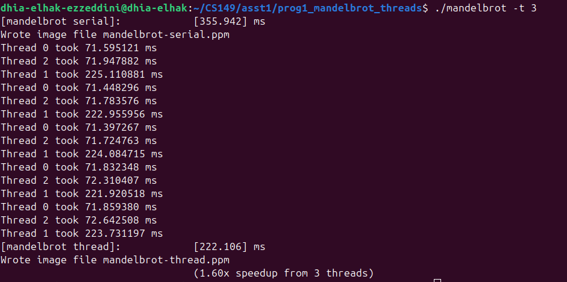

# Assignment 1: Performance Analysis on a Quad-Core CPU

## Program 1: Parallel Fractal Generation Using Threads

### Questions 1, 2 & 3 : 

For the viw 1 , the speedup is not linear and this is due to the huge differences between different regions of the image, Focusing on 3-threaded datapoint we ca sse that thread 1 , middle thread out of 3 threads, takes so long to complete compared to the two other threads and this is due to the high computations occuring in the middle region of the view 1 , seeing the view 2 speedup we can see it is almost linear and this is due to the more distributed computations across the image

#### Speedup Graph 

### Questions 4 & 5 : 

To improve speedup to at about 7-8x on both views of the Mandelbrot set, I tried to spread out the thread computations over the rows of the image, meaning that each thread does not run locally on a subset of the image but it runs on different rows in different regions along the height of the image, for the implementation I used Interleaved assignment to achieve ***7.16x speedup for 8 threads*** and ***13.02x speedup for 16 threads***  

#### Function : 

#### Speedup Graph : 

